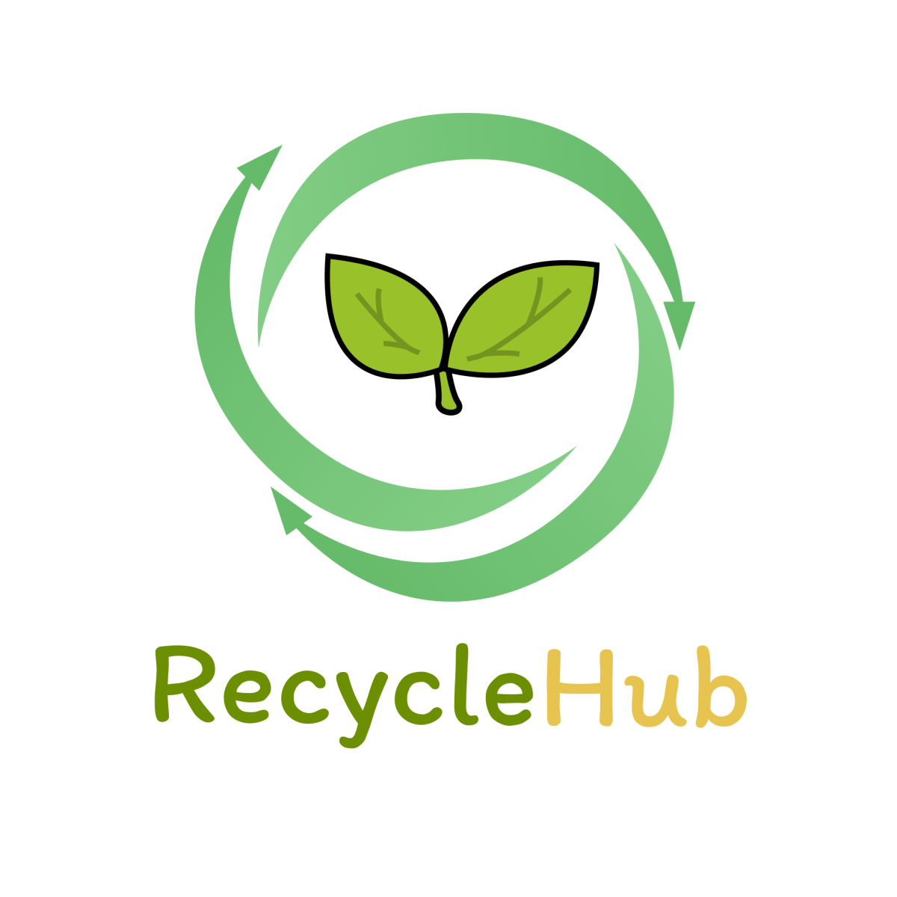

# RecycleHub
<!-- 
 -->


RecycleHub is a recycling management application that connects individuals with certified waste collectors. The project is developed as a Single Page Application (SPA) using Angular for the front-end. This application aims to automate and streamline the recycling process, making it easier for users to manage waste collection requests.

---

## Table of Contents
- [Project Context](#project-context)
- [Features](#features)
- [Technologies Used](#technologies-used)
- [Evaluation Criteria](#evaluation-criteria)
- [Getting Started](#getting-started)
---

## Project Context

RecycleHub is designed to facilitate the recycling process by connecting individuals with certified waste collectors. The application allows users to submit waste collection requests, track their status, and earn points based on the type and quantity of waste recycled. Collectors can manage and validate these requests, ensuring a seamless recycling experience.

---

## Features

### 1. **User Authentication**
   - **Registration**: Individuals can create an account with the following details:
     - Email and password
     - First and last name
     - Full address
     - Phone number
     - Date of birth
     - Profile picture (optional)
   - **Login**: A single login interface for both individuals and collectors.
   - **Profile Management**: Users can update their information or delete their account.

### 2. **Waste Collection Requests**
   - Individuals can submit collection requests with:
     - Type of waste (plastic, glass, paper, metal)
     - Photos of the waste (optional)
     - Estimated weight (minimum 1000g)
     - Collection address
     - Preferred date and time slot (between 09:00 and 18:00)
     - Additional notes (optional)
   - **Request Status**: Requests can have the following statuses:
     - Pending
     - Occupied (collector has accepted the request)
     - In Progress (collector is on-site)
     - Validated
     - Rejected
   - **Limitations**:
     - Maximum of 3 pending requests per user.
     - Maximum total weight of 10kg per collection.

### 3. **Collection Process**
   - Collectors can view and accept collection requests from their city.
   - Collectors validate the collection by:
     - Verifying the type of waste.
     - Weighing and confirming the actual weight.
     - Taking photos (optional).
     - Marking the request as validated or rejected.

### 4. **Points System**
   - Points are awarded based on the type and weight of waste:
     - Plastic: 2 points/kg
     - Glass: 1 point/kg
     - Paper: 1 point/kg
     - Metal: 5 points/kg
   - Points can be converted into vouchers:
     - 100 points = 50 Dh voucher
     - 200 points = 120 Dh voucher
     - 500 points = 350 Dh voucher

---

## Technologies Used

- **Front-End**:
  - Angular 17+ (modules or standalone components)
  - NgRx for state management
  - RxJS/Observables for reactive programming
  - Reactive Forms or Template-Driven Forms
  - Bootstrap or Tailwind CSS for styling
  - Guards, Resolvers, and Routing
  - Data binding, Pipes, and Services
- **Persistence**:
  - Local storage or any chosen method for data persistence
- **Other**:
  - Responsive design
  - Validation with error messages

---

## Getting Started

### Prerequisites
- Node.js and npm installed.
- Angular CLI installed globally.

### Installation
1. Clone the repository:
   ```bash
   git clone https://github.com/your-username/recyclehub.git
   ````

Navigate to the project directory:

- cd recyclehub
Install dependencies
   ```bash
   npm install
   Run the application:
    ```
   ```bash
   ng serve
   ````
- Open your browser and navigate to http://localhost:4200